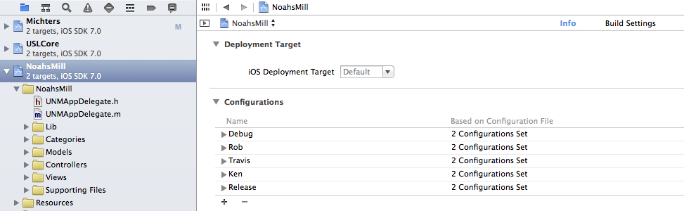
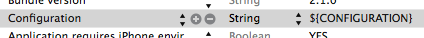
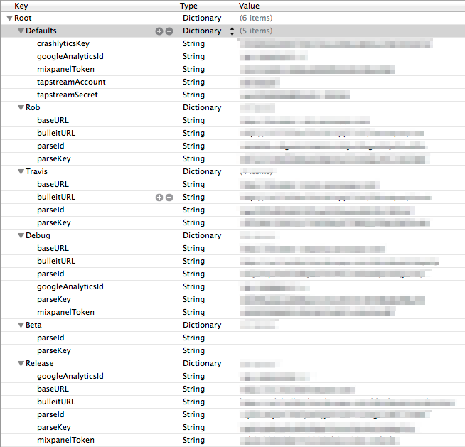
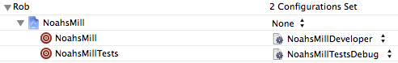

DIConfiguration
================

Per-environment configuration for Xcode, using configurations.

## About

DIConfiguration allows you to access configuration parameters throughout
your codebase that are determined by the `Configuration` that was set
when the app was compiled.  The advantage of this approach over
environment variables (which are set at runtime by xcode) is that the
app can be distributed to devices and maintain the environment info.

See [this post from carbon five](http://blog.carbonfive.com/2011/06/20/managing-ios-configurations-per-environment-in-xcode-4/)
for the inspiration and more background.

## Usage

### Configuration inheritance

**READ THIS FIRST**

You need the context of the docs below to understand why this step is
necessary, but you want to perform this step first to save some pain.

A side-effect of having multiple Configurations in xcode, which are likely
all very similar, is that they are not super fun to maintain.  Each entry
in the project file will be a giant duplicate of the one before it.  So
there is a python script included in this project to convert the contents
of your Release and Debug configurations into a set of .xcconfig files,
each of which can inherit from a parent.

The script does its best to push common settings up the inheritance tree.

The python you have installed (probably 2.7.x) should be fine without any
additional libs.  You can run it like:

```
PYTHONPATH=path/to/DIConfiguration python path/to/DIConfiguration/bin/generate-config.py path/to/xcodeproj.pbxproj
```

It will generate the .xcconfigs in your current path and will not edit
your xcode project file.

Just hang on to those files for now.

### Add necessary configurations

Xcode sets 2 default configurations on your project ('Release' & 'Debug').
For each environment (e.g., each developer), create an additional
configuration.

In Xcode 5, this is done by selecting the project in the Project Navigator
view, then selecting the project (as opposed to a target) in the dropdown
and ensuring you are on the 'Info' pane.

Click on the '+' to add a new Configuration.  It will look something like:



### Capture configuration during build

In your <App>-Info.plist file, add a new value of type `String` with
key `Configuration` and value `${CONFIGURATION}`.  This value captures
the value of `${CONFIGURATION}` at build time and stores it in the
plist.



### Set your per-environment variables

Create a file named `Environments.plist` (it's xcode, but it wherever you
want).  Within that file, create a `Dictionary` for each configuration.
They key for that dictionary should be the name of the configuration.

Also, create one more `Dictionary` under the key `Defaults` with
any shared (or default) configuration items.

Here is an example of a complete file:



### Configuration files

Now that the environments are set up, you want to switch to using the
.xcconfig files that you created at the beginning.

First, point your build configurations to the leaf files in your
hierarchy.  You can make this change in the same place you created
the configurations:



Finally, you need to delete all the settings from the xcode project file.
First, close xcode (or at least the project or workspace you are about to
manually modify).  Here, the wise practitioner will also make a backup of
of the project file.  Not that you aren't using git.
Search your project file (AwesomeApp.xcodeproj/project.pbxproj) for all
occurrences of `buildSettings`.

They will look like:

```
buildSettings = {
    SETTING = something;
    OTHER_SETTING = something else;
    ...
};
```

Remove all the content between the braces, so they look like:

```
buildSettings = {
};
```

The settings will be read from the .xcconfig files, so you don't want them
overridden by the project.

Open your project in xcode again and try to build it.  Should be great.  Might
not be.  Retrace your steps, open an issue, tweet.

## Support

Brought to you by [Rob Zuber](http://github.com/z00b),
[Travis Vachon](http://github.com/travis),
and the [distiller.io](http://distiller.io) team.

Open an issue on github or find us on twitter:
* [@z00b](http://twitter.com/z00b)
* [@tvachon](http://twitter.com/tvachon)
* [@AppDistiller](http://twitter.com/AppDistiller)


Let us know how we can help.

## TODO

* podify
